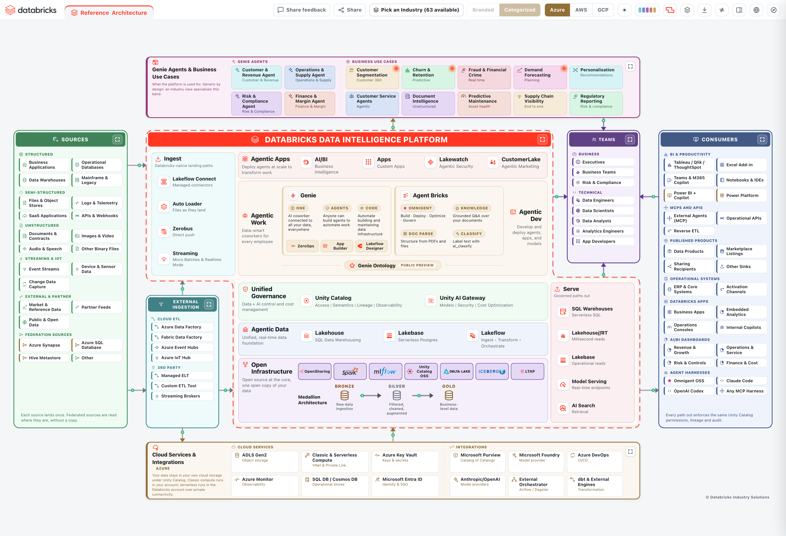
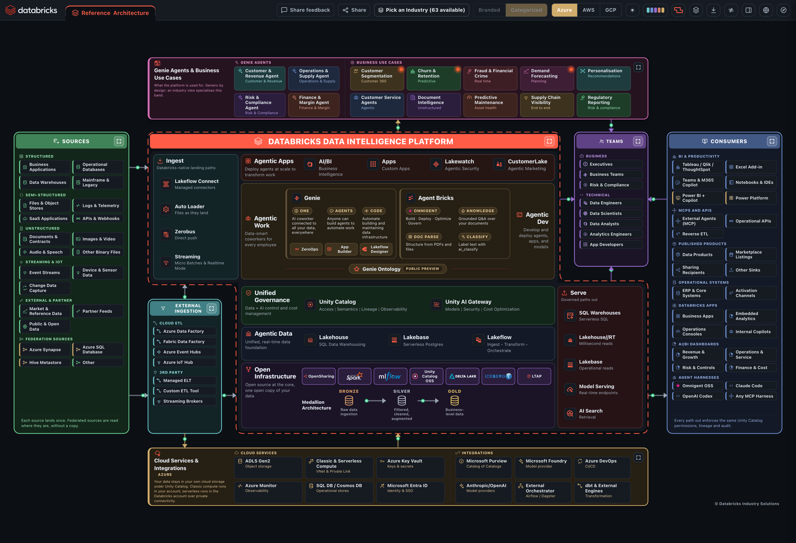
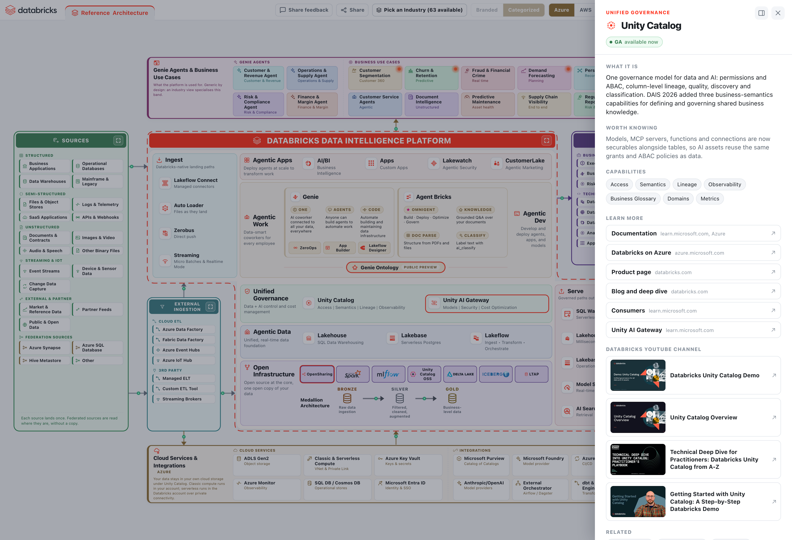
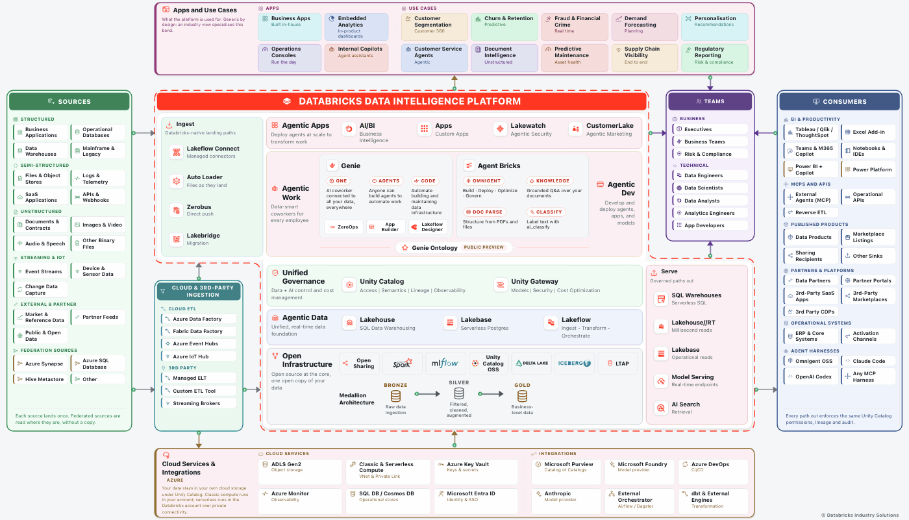

# IDEA: Interactive Databricks Enterprise Architecture

An interactive, editable, exportable reference architecture for the Databricks
Data Intelligence Platform. One HTML file, no build step, no dependencies, no
backend. Open it locally, or deploy it into your own Databricks workspace as an
app your teams can reach from the workspace navigation.



---

## What it is

Most reference architectures are a picture. Someone drew it in a diagramming
tool, exported a PNG, and pasted it into a deck. It is accurate on the day it is
made, it cannot be interrogated, and adapting it to a specific customer means
starting again in the source tool, which nobody has.

IDEA is the same architecture as a live document:

- **Every box is a real product**, and clicking it opens what it is, what a
  customer would not learn from the name, the documentation for the cloud you
  are on, the product page, and further reading.
- **The cloud provider is a switch.** AWS, Azure and GCP swap the storage,
  compute, identity, and ingestion services, and every documentation link
  re-points at that cloud's own docs.
- **It is editable.** Rename boxes, add them, move them between zones, and start
  a second architecture in a new tab for a specific customer.
- **It exports.** PDF, PowerPoint with native editable shapes, PNG, an animated
  GIF that keeps the flow moving, and a standalone HTML copy of whatever you
  changed.



---

## What it shows

The diagram is arranged as a Z: sources on the left, the platform through the
middle, consumers on the right, with the people who use it and the cloud it runs
on wrapped around the outside.

| Zone | What sits there |
|---|---|
| **Sources** | Structured, semi-structured, unstructured, streaming and IoT, external and partner data, and federation sources reached without copying |
| **Cloud and 3rd-party ingestion** | The cloud's own ETL services, third-party ELT and streaming brokers that land data alongside the platform's native ingestion |
| **Platform** | Ingest, Agentic Apps, Agentic Work, Unified Governance, Agentic Data, Open Infrastructure and the medallion layers, drawn as one Z-shaped outline traced by a moving ring |
| **People** | The business and technical roles the platform is built for |
| **Consumers** | BI and productivity tools, MCP and APIs, published data products, partners and platforms, and operational systems |
| **Apps, use cases and agent harnesses** | What the platform is used for, industry-neutral by design |
| **Cloud services and integrations** | The account's own storage, compute, key vault, catalog, identity and observability services |

Arrows carry travelling dashes in the direction the data actually moves, so the
diagram reads as flow rather than as a wall of boxes.



---

## Capabilities

### Interaction

| | |
|---|---|
| **Click any box** | Opens a drawer with a plain-English description, one thing worth knowing that the name does not tell you, links, and related boxes you can jump to |
| **Cloud switch** | AWS, Azure, GCP. Swaps cloud-specific tiles and re-points every documentation link at that cloud's docs, including the Microsoft Learn pages on Azure |
| **Medallion layers** | Bronze, Silver and Gold each open the [Databricks Industry Data Models](https://github.com/databricks-industry-solutions/lakehouse-industry-data-models) repository, the [launch blog](https://www.databricks.com/blog/jumpstart-your-data-modeling-databricks-industry-data-models), the [Vibe Data Modeling blog](https://www.databricks.com/blog/reimagining-data-modeling-lakehouse-introducing-vibe-data-modeling) and the [agent that generates them](https://github.com/databricks-industry-solutions/lakehouse-industry-data-models/tree/main/model-agent) |
| **Platform focus** | Collapses everything except the platform, for when the conversation is about the platform alone |
| **Search and keyboard** | Every box is reachable by keyboard, and the drawer closes on Escape |

### Appearance

| | |
|---|---|
| **Dark and light** | Follows the operating system by default, and remembers an explicit choice |
| **Palettes** | Several harmonised colour schemes, generated by `tools/palgen.py` rather than hand-picked, so every zone colour is solved against its own background for WCAG AA contrast in both themes |
| **Brand marks** | Apache Spark, MLflow, Delta Lake, Unity Catalog, Apache Iceberg and Delta Sharing render as their real logos, with the neutral ink tokenised so they stay legible when the theme flips |

### Editing

| | |
|---|---|
| **Tabs** | The Reference tab is pinned. `+` starts a new architecture, renamed by double-click and closed with its own x |
| **Edit mode** | Add, rename, remove and re-parent boxes |
| **Persistence** | Everything you change is kept in the browser's local storage, so a reload does not lose it |

### Exports

| Format | What you get |
|---|---|
| **PDF** | One page, vector text, sized to the diagram, in the current theme and palette |
| **PowerPoint** | Native shapes, text boxes and connectors, editable in PowerPoint. Pictures are used only where the artwork is a real logo |
| **PNG** | 2x raster of the current view |
| **GIF** | A looping animation, 1400px wide, twelve frames, that keeps the travelling dashes and the platform ring moving. Roughly 90 KB, because only the moving pixels are stored in each frame |
| **HTML** | A standalone copy of the page with your edits baked in, which opens anywhere with no server |



---

## How to deploy

### Option 1: the installer notebook (recommended)

The repository ships an installer that creates the Databricks App and deploys
the diagram into it. It needs no catalog, no SQL warehouse and no data access:
the app serves one static file, and its service principal reads nothing.

1. In your Databricks workspace, choose **Workspace -> Create -> Git folder**
   and clone this repository.
2. Open **`app-installer.ipynb`** from inside that folder.
3. **Run All.** The defaults are correct for this path.
4. When it finishes it prints a link. The app also appears under
   **Compute -> Apps -> idea**.

Widgets, if you want to change something:

| Widget | Default | What it does |
|---|---|---|
| `01_app_name` | `idea` | Name of the Databricks App. Lowercase letters, digits and dashes |
| `02_source` | Beside this notebook | Where the app files come from. Leave it alone when running from a Git folder |
| `03_github_repo` | this repo | Only read when `02_source` is *Download from GitHub* |

Choose **Download from GitHub** if you imported only the notebook rather than
cloning the repository. It pulls the archive over HTTPS and writes the `app/`
folder into your workspace home. Two things have to be true for it to work: the
workspace needs outbound internet access, and the repository has to be readable
without a token. While this repository is private, use the Git folder path.

To upgrade later: **Pull** on the Git folder, then Run All again. The installer
reuses the existing app and redeploys it.

**Prerequisites**

- Databricks Apps enabled on the workspace (*Compute -> Apps*)
- Permission to create apps, which workspace admins have by default

**Cost.** The app runs on its own small serverless compute. Stop it from
*Compute -> Apps* when you are not showing it.

### Option 2: the CLI

If you would rather not run a notebook:

```bash
# 1. put the app files in the workspace
databricks workspace mkdirs "/Users/$USER/idea/app"
for f in index.html main.py app.yaml; do
  databricks workspace import "/Users/$USER/idea/app/$f" --file "app/$f" \
    --format AUTO --overwrite
done

# 2. create the app and deploy into it
databricks apps create idea
databricks apps deploy idea --source-code-path "/Workspace/Users/$USER/idea/app"
```

### Option 3: no Databricks at all

`app/index.html` is self-contained. Double-click it, or serve the folder:

```bash
cd app && python3 main.py     # http://localhost:8000
```

---

## Repository layout

```
app-installer.ipynb        Databricks App installer, Run All
app/
  index.html               the whole diagram: markup, styles, logic, logos
  main.py                  static server for Databricks Apps, standard library only
  app.yaml                 Databricks App entry point
docs/                      screenshots and the animated export used above
tools/
  palgen.py                generates the colour palettes with solved contrast
  build_installer.py       generates app-installer.ipynb from readable sources
```

---

## How it is built

**One file.** `app/index.html` carries the markup, the styles, the logic, the
architecture model and the logos. There is no bundler, no package manager and
nothing to install. Opening it from a file path works, which matters because
that is how most people will first see it.

**The model is data.** The architecture lives in a single `ARCH` object, and the
zones render from it. The reference material behind each box is a separate table
on purpose: `ARCH` is what a user edits and what gets saved and exported, while
the product descriptions and links are fixed facts that have no business being
editable.

**Exports are written by hand.** The PDF, PowerPoint and GIF writers are in the
file. Pulling in a library for each format would be more code than the formats
need, and would put the exports behind a network fetch that a workspace with no
internet egress would fail on.

**Colours are solved, not chosen.** `tools/palgen.py` takes a hue recipe per
zone and walks lightness until the foreground clears WCAG AA against the
background it will actually sit on, in both themes, then emits the CSS.

**The animation survives export.** A raster export freezes every CSS animation,
so a naive GIF would be twelve identical frames. Each connector's dash travel is
also expressed as a function of a `--dash-t` phase variable, which the GIF
encoder walks one step per frame. Only the moving pixels differ between frames,
and the encoder stores the rest as transparent, which is why the animation fits
in about 90 KB.

---

## Credits

Built by Amr Ali, Databricks Middle East and Africa.

The Apache Spark, MLflow, Delta Lake, Unity Catalog, Apache Iceberg and Delta
Sharing marks belong to their respective projects and are used to identify those
projects.
