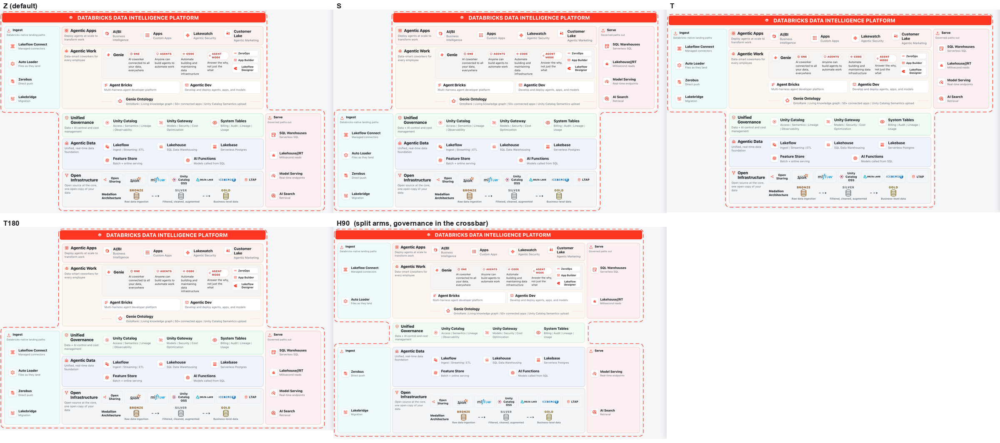
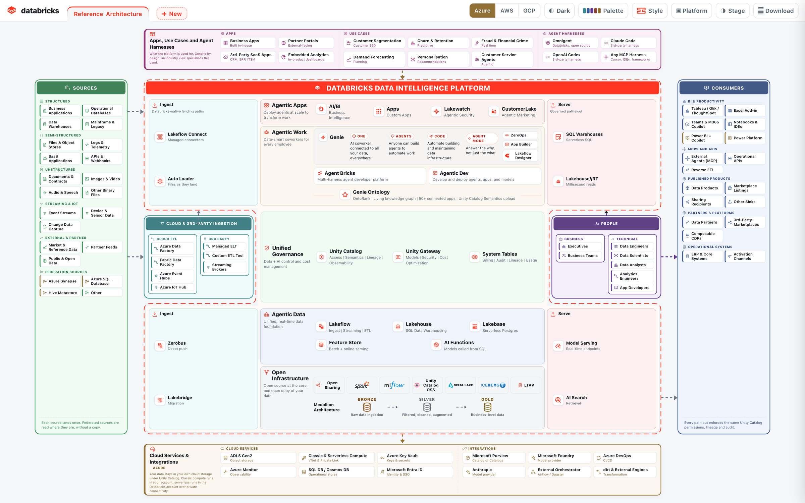
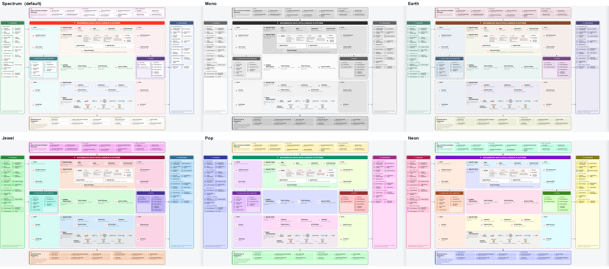

# IDEA: Interactive Databricks Enterprise Architecture

An interactive, exportable reference architecture for the Databricks Data
Intelligence Platform. One HTML file, no build step, no dependencies, no
backend. Open it locally, or deploy it into your own Databricks workspace as an
app your teams reach from the workspace navigation.


---

## What it is

Most reference architectures are a picture. Someone drew it in a diagramming
tool, exported a PNG, and pasted it into a deck. It is accurate on the day it is
made, it cannot be interrogated, and adapting it to a specific customer means
starting again in the source tool, which nobody has.

IDEA is the same architecture as a live document:

- **Every box is a real product**, and clicking it opens what it is, what a
  customer would not learn from the name, its release stage, the documentation
  for the cloud you are on, the product page, and related boxes you can jump to.
- **The cloud provider is a switch.** Azure, AWS and GCP swap the storage,
  compute, identity and ingestion services, and every documentation link
  re-points at that cloud's own docs.
- **The platform is drawn in five shapes**, so the same architecture fits a
  16:9 slide, a portrait page, or a layout that has to leave room for a third
  party in the middle.
- **Release stage is a filter.** Show GA only for a procurement conversation, or
  add Beta and the previews for a roadmap one.
- **It exports.** PDF, PowerPoint with native editable shapes, PNG, an animated
  GIF that keeps the flow moving, and a standalone HTML copy.


---

## What it shows

Sources on the left, the platform through the middle, consumers on the right,
with the people who use it and the cloud it runs on wrapped around the outside.

| Zone | What sits there |
|---|---|
| **Sources** | Structured, semi-structured, unstructured, streaming and IoT, external and partner data, and federation sources reached without copying |
| **Cloud and 3rd-party ingestion** | The cloud's own ETL services, and third-party ELT and streaming brokers that land data alongside the platform's native ingestion |
| **Platform** | Ingest, Agentic Apps, Agentic Work, Unified Governance, Agentic Data, Open Infrastructure and the medallion layers, drawn as one outline traced by a moving ring |
| **People** | The business and technical roles the platform is built for |
| **Consumers** | BI and productivity tools, MCP and APIs, published data products, partners and platforms, and operational systems |
| **Apps, use cases and agent harnesses** | What the platform is used for, industry-neutral by design |
| **Cloud services and integrations** | The account's own storage, compute, key vault, catalog, identity and observability services |

### How to read it

| Signal | Meaning |
|---|---|
| **Solid arrow** | Data moves along it, and the travelling dashes run in the direction it actually flows |
| **Dashed zone outline** | A grouping, not a boundary that data crosses |
| **The ring around the platform** | One continuous outline: the platform is one product, not a stack of separate ones |
| **Colour** | Identifies the zone, never the status. Every zone keeps its own hue in every palette and both themes |

---

## The controls

Seven controls, left to right, sitting in the header above the diagram.

| Control | What it does |
|---|---|
| **Cloud** | Azure, AWS, GCP. Swaps the cloud services band, the cloud ETL tiles and the federation sources, and re-points every documentation link at that cloud's own docs, including the Microsoft Learn pages on Azure |
| **Dark / Light** | Follows the operating system by default, and remembers an explicit choice. Downloads follow whatever is on screen |
| **Palette** | Thirteen colour schemes in three groups |
| **Style** | Five platform shapes |
| **Platform** | Zooms into the platform on its own: hides sources, consumers, the apps band and the cloud services. Exports respect it |
| **Stage** | Filters the platform box by release stage |
| **Download** | PDF, PowerPoint, PNG, GIF, HTML |

Everything that acts on a diagram goes inert on a tab that has no diagram yet,
so the toolbar cannot be used against nothing. Dark/Light and Cloud stay live,
because they are global and are the two things worth setting before a diagram
exists.

### Style: five platform shapes



| Shape | Why it exists |
|---|---|
| **Z** | The default. Ingest reaches left over the sources, serving reaches right over the consumers |
| **S** | The Z mirrored, for when the story runs right to left |
| **T** | Both arms on top, for a wide slide with a short middle |
| **T180** | Both arms underneath |
| **H90** | A full I-beam: three rows with split arms and pockets inside the notches, which is what leaves room for the cloud and third-party ingestion to sit *inside* the shape rather than beside it |

Every shape is measured, not eyeballed: the two pockets are equalised to the
taller one, so the arms stay symmetrical to the pixel in all five.

H90 works differently enough from the other four to be worth spelling out. Each
pocket splits into two labelled boxes side by side, Cloud ETL beside 3rd Party
and Business beside Technical, and each box runs its tiles down a single column.
Both pockets sit inside their own arm column rather than spanning the middle, so
the crossbar of the I stays clear, and the governance band renders there instead
of in the lower block: the narrow middle of the shape carries the platform's
control plane rather than being a spacer. The arms are wider here than in the
other shapes to fit those boxes, and the design canvas is wider to match, which
is free because the fit in this shape is bound by height rather than width.



### Palette: thirteen schemes, solved rather than picked



| Group | Palettes |
|---|---|
| **Neutral** | Spectrum (default), Mono (print safe), Muted (low chroma), Nordic (cool calm) |
| **Coloured** | Ocean (analogous), Earth (warm neutral), Sunset (warm shift), Berry (cool warm) |
| **Loud** | Solid (filled), Jewel (deep), Vivid (projector), Pop (playful), Neon (maximum) |

`tools/palgen.py` generates all of them. For every zone hue it walks lightness
until four values clear WCAG AA against the surface each one actually sits on,
in both themes: the zone fill, the chip tile inside it, the border, and the ink
on top. Nothing here is hand-picked, which is why Neon is legible and Mono
survives a black and white printer.

Spectrum keeps the chips white so the reference reads as a document. Every other
palette tints the chips too, so a palette choice is visible in every box rather
than in the labels alone.

### Stage: filter by release stage

| Stage | |
|---|---|
| GA | Available now |
| Public Preview | |
| Beta | |
| Private Preview | |
| Coming soon | |

Each row carries the number of boxes it would show, and switching a stage off
removes those boxes from the platform, closes the gap and re-traces the ring.
Unstaged boxes always stay. An `st` value the app does not recognise is treated
as unstaged rather than quietly filed as available, because the conservative
reading is the honest one in front of a customer.

### Download

| Format | What you get |
|---|---|
| **PDF** | One page, vector text, sized to the diagram, in the current theme and palette |
| **PowerPoint** | Native shapes, text boxes and connectors, editable in PowerPoint. Pictures are used only where the artwork is a real logo. The platform ring exports as one shape, filtered or not |
| **PNG** | 2x raster of the current view |
| **GIF** | A looping animation, 1400px wide, twelve frames, that keeps the travelling dashes and the platform ring moving. Roughly 200 KB, because only the moving pixels are stored per frame, in the palette and theme on screen |
| **HTML** | A standalone copy of the page with your current choices baked in, which opens anywhere with no server |


---

## The detail drawer

Click any box.


| Section | |
|---|---|
| **Stage badge** | GA, Beta or the preview the box is in |
| **What it is** | Plain English, no marketing |
| **Worth knowing** | The thing the name does not tell you |
| **Capabilities** | What it actually does |
| **Learn more** | Cloud-specific documentation, the cloud vendor's own page, the product page, and a blog or deep dive |
| **Related** | The boxes it touches, which highlight on the diagram and are one click away |

The three medallion layers each open the
[Databricks Industry Data Models](https://github.com/databricks-industry-solutions/lakehouse-industry-data-models)
repository, the
[launch blog](https://www.databricks.com/blog/jumpstart-your-data-modeling-databricks-industry-data-models),
the
[Vibe Data Modeling blog](https://www.databricks.com/blog/reimagining-data-modeling-lakehouse-introducing-vibe-data-modeling)
and the
[agent that generates the models](https://github.com/databricks-industry-solutions/lakehouse-industry-data-models/tree/main/model-agent).

Every box is reachable by keyboard, and Escape closes the drawer.

---

## Tabs

The **Reference Architecture** tab is pinned and cannot be closed. **`+`** opens
a tab of your own, renamed by double-click and closed with its own x. The strip
scrolls horizontally with arrows on whichever side has more to show, so adding
tabs never pushes the toolbar off the right edge.

A tab of your own opens a builder: a description of the customer, their use
cases, sources and consumers, plus the cloud to draw it on.

**The generator is not connected to a model.** `buildFromDescription()` in
`app/index.html` is a single documented hook that is handed everything a model
would need and everything it has to write back, and it currently answers with a
notice saying so. Wiring an LLM to it is one function, and nothing else in the
file has to change. The editing engine behind it (add, rename, remove and
re-parent boxes) is in the file and working, but has no button in the header
today: it is reached from a generated diagram, not from the reference one.

What is remembered between visits: theme, palette, platform shape, stage filter,
and your tabs with their descriptions, including which one was open. The cloud
switch and Platform-only start fresh on every load, because both are how you
frame one conversation rather than a preference.

---

## How to deploy

### Option 1: the installer notebook (recommended)

The repository ships an installer that creates the Databricks App and deploys
the diagram into it. It needs no catalog, no SQL warehouse and no data access:
the app serves one static file, and its service principal reads nothing.

1. In your Databricks workspace, choose **Workspace -> Create -> Git folder**
   and clone this repository.
2. Open **`app-installer.ipynb`** from inside that folder.
3. **Run All.** The defaults are correct for this path.
4. When it finishes it prints a link. The app also appears under
   **Compute -> Apps -> idea**.

Widgets, if you want to change something:

| Widget | Default | What it does |
|---|---|---|
| `01_app_name` | `idea` | Name of the Databricks App. Lowercase letters, digits and dashes |
| `02_source` | Beside this notebook | Where the app files come from. Leave it alone when running from a Git folder |
| `03_github_repo` | this repo | Only read when `02_source` is *Download from GitHub* |

Choose **Download from GitHub** if you imported only the notebook rather than
cloning the repository. It pulls the archive over HTTPS and writes the `app/`
folder into your workspace home. Two things have to be true for it to work: the
workspace needs outbound internet access, and the repository has to be readable
without a token. While this repository is private, use the Git folder path.

To upgrade later: **Pull** on the Git folder, then Run All again. The installer
reuses the existing app and redeploys it.

**Prerequisites**

- Databricks Apps enabled on the workspace (*Compute -> Apps*)
- Permission to create apps, which workspace admins have by default

**Cost.** The app runs on its own small serverless compute. Stop it from
*Compute -> Apps* when you are not showing it.

### Option 2: the CLI

If you would rather not run a notebook:

```bash
# 1. put the app files in the workspace
databricks workspace mkdirs "/Users/$USER/idea/app"
for f in index.html main.py app.yaml; do
  databricks workspace import "/Users/$USER/idea/app/$f" --file "app/$f" \
    --format AUTO --overwrite
done

# 2. create the app and deploy into it
databricks apps create idea
databricks apps deploy idea --source-code-path "/Workspace/Users/$USER/idea/app"
```

Redeploying after a change is the same two steps without `apps create`.

### Option 3: no Databricks at all

`app/index.html` is self-contained. Double-click it, or serve the folder:

```bash
cd app && python3 main.py     # http://localhost:8000
```

---

## Repository layout

```
app-installer.ipynb        Databricks App installer, Run All
app/
  index.html               the whole diagram: markup, styles, logic, model, logos
  main.py                  static server for Databricks Apps, standard library only
  app.yaml                 Databricks App entry point
docs/                      the screenshots and the animated export used above
tools/
  palgen.py                generates the colour palettes with solved contrast
  markgen.py               fetches the official product marks and inlines them
  build_installer.py       generates app-installer.ipynb from readable sources
```

---

## How it is built

**One file.** `app/index.html` carries the markup, the styles, the logic, the
architecture model and the logos. There is no bundler, no package manager and
nothing to install. Opening it from a file path works, which matters because
that is how most people will first see it.

**The model is data.** The architecture lives in a single `ARCH` object, and the
zones render from it. The reference material behind each box is a separate table
on purpose: `ARCH` is what a user edits and what gets saved and exported, while
the product descriptions, stages and links are fixed facts that have no business
being editable.

**Exports are written by hand.** The PDF, PowerPoint and GIF writers are in the
file. Pulling in a library for each format would be more code than the formats
need, and would put the exports behind a network fetch that a workspace with no
internet egress would fail on.

**Colours are solved, not chosen.** `tools/palgen.py` takes a hue recipe per
zone and walks lightness until every foreground clears WCAG AA against the
surface it will actually sit on, in both themes, then emits the CSS.

**The animation survives export.** A raster export freezes every CSS animation,
so a naive GIF would be twelve identical frames. Each connector's dash travel is
also expressed as a function of a `--dash-t` phase variable, which the GIF
encoder walks one step per frame. Only the moving pixels differ between frames,
and the encoder stores the rest as transparent, which is why twelve frames of a
1400px board fit in about 200 KB.

**The layout is measured, not tuned.** The board is laid out at a fixed design
width and then scaled to fit, and the two halves of the platform are balanced
after the first measurement and re-measured before the scale is applied. That is
why a shape change, a stage filter and a palette switch all land on the same
symmetrical geometry instead of drifting a few pixels each time.

---

## Credits

Built by **Ashraf Osman & Amr Ali**.

The Apache Spark, MLflow, Delta Lake, Unity Catalog, Apache Iceberg and Delta
Sharing marks belong to their respective projects and are used to identify those
projects.
